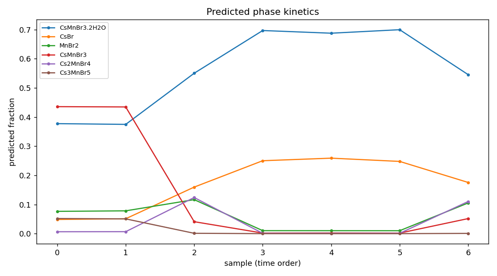

# Physics-informed autoencoder for PDF phase decomposition

A neural approach to decomposing a time/composition series of atomic PDFs `X`
(each row a `G(r)` curve) into **concentrations `G`** and **structure signatures
`F`**, i.e. `X ≈ G · Fᵀ` — the same factorization targeted by Semi-NMF, but
recast so the basis is fixed to *real* phases and the problem becomes
well-posed, supervised, and generalizable.

## Why an autoencoder (vs. blind Semi-NMF)

Blind Semi-NMF on a single experimental matrix is ill-posed: it converges, but
to a sign/permutation/rotation-ambiguous optimum, and on real data it plateaus
(reference mismatch, noise). We instead **fix the decoder to a dictionary of
real phase PDFs** computed from Materials Project + CIFs. The encoder then only
has to predict *which* phases are present and in *what* fractions — a supervised
regression with a meaningful loss and **no rotational ambiguity**.

## Architecture

```
X_t (n_r)  ──[ 1D-CNN encoder, narrow kernels over r ]──►  G_t  (softmax over P phases, ≥0, Σ=1)
                                                              │
                          F = frozen dictionary Dᵀ (P × n_r)  │  (decoder = matrix multiply)
                                                              ▼
                                                       X̂_t = G_t · Fᵀ
```

1. **Encoder (CNN, `X → G`)** — stacked 1D convolutions with *narrow* kernels
   along the `r`-axis (so the network reads local PDF features and cannot
   "cheat" by memorising the whole curve), then a dense head with a **softmax**
   output of dimension `P` (number of dictionary phases). Softmax enforces
   `G ≥ 0` and closure (`Σ = 1`).
2. **Decoder (`G · Fᵀ → X̂`)** — a single bias-free linear layer whose weights
   are the **frozen real-PDF dictionary** `F`. The reconstruction is exactly the
   physical model `X̂ = G · Fᵀ`.
3. **Predictive-coding variant** (`seminmf_pc.py`, FabricPC/JAX) — the same
   generative model `X ≈ F·softplus(G)` trained by predictive coding: the latent
   `G` is *inferred* per sample by energy minimisation (like MCR-ALS) rather than
   by a feed-forward encoder, which suits the low-data regime.

### Loss

The shipped supervised trainer (`train_amortized.py`) optimises:

```
L = ‖G − G_true‖²                  (supervised concentration loss — the "true values")
  + α · ‖X − G·Fᵀ‖²_scale-invariant  (reconstruction; α = LAMBDA_RECON, default 0)
```

The other physics-informed priors are realised **structurally**, not as trainable
penalties:

- **Smoothness of F** — `F` is *frozen* to real, physically-smooth phase PDFs, so
  the structure signatures are smooth by construction (no trainable `∇_r F` term).
- **Regularity of G** — the softmax output enforces `G ≥ 0` and closure (`Σ = 1`),
  keeping concentrations on the physical simplex. An explicit temporal
  `‖∇_t G‖²` kinetics-smoothness term lives in the generative predictive-coding
  variant (ordered data); it is *not* active in the shuffled supervised default.

Training on **known answers** makes the supervised loss well-posed. The
**predictive-coding variant** (`seminmf_pc.py`) is the **unsupervised /
self-supervised** mode — it reconstructs `X` and *infers* `G` by energy
minimisation with no labels.

> `α` defaults to 0: under the heavy sim-to-real augmentation, reconstruction
> against the clean dictionary is degenerate (even a perfect `G` does not
> minimise it), so the supervised concentration loss is the reliable signal.

## The "unknown phase" sink

A 13th **`other`** channel is added to the dictionary. ~35 % of synthetic runs
contain a phase *outside* the dictionary (a random non-dictionary PDF) labelled
as `other`. This teaches the network to route unrecognised signal to `other`
instead of force-fitting it onto the known phases — essential for real data,
where an out-of-dictionary phase would otherwise be mis-assigned.

## Synthetic data + augmentation (`make_dataset.py`)

Versatile labelled mixtures: family-aware phase subsets (Br/Cl/O families +
shared precursors), multiple reaction-kinetics schemes (first-order consecutive
A→B→C, Gaussian bumps, monotone rise/fall), and **sim-to-real augmentation** so
the model is invariant to how real PDFs differ from the canonical dictionary:

- lattice strain (±4 %, resampling `g(r/s)`),
- extra Gaussian peak broadening (≤ 0.12 Å),
- high-r `qdamp`-like damping,
- a smooth experimental background.

Train/validation are split **by run** (not by time-point) so validation
mixtures are fully independent of training — no leakage.

## Results — synthetic (held-out, run-level split)

Full training (81k samples / 60 epochs, GPU). Metrics on independent runs:

| model | val concentration-MAE | phase-detection F1 |
|---|---|---|
| 12 known phases | **0.008** | **0.95** |
| + 13th "unknown" sink (35 % contaminated, harder) | **0.015** | **0.89** |

The model recovers phase fractions to ~1–2 % absolute error and detects which
phases are present with F1 ≈ 0.9 **even under the 13-class "unknown" problem**
and the realistic distortions above.

## Results — experimental

Running the trained encoder on real X-ray PDFs (`predict_on_real.py`):

**`mystery_phase1.gr`** (a previously-unidentified pattern):

```
CsMnBr3·2H2O   55.3 %
CsBr           39.6 %
CsMnCl3         4.4 %
```

The 4.4 % CsMnCl3 is below the ~5 % discard threshold and is spurious given the
independently-confirmed bromide chemistry (below), so the result is read as a
**two-phase mixture of CsMnBr3·2H₂O + CsBr** (CsBr = unreacted precursor).
Refining exactly these two phases against
the data in PDFFIT gives **Rw = 0.304** over 1.5–10 Å (reduced χ² ≈ 0.006),
with CsBr refining to its true cubic lattice (a ≈ 4.26 Å, lit. 4.29) — a
physically plausible fit that pins both the structures and their relative
concentrations.

**Br/Cl composition series** (`predict_on_real.py data/`): the model assigns
bromide phases (CsMnBr3, CsMnBr3·2H₂O, CsBr, MnBr2) across the whole series and
produces a smooth predicted-kinetics trajectory:



(An independent PDF-vs-dictionary correlation test confirmed these nominally
"Cl" files are physically bromide — i.e. the model's reading is correct, the
filenames were mislabelled.)

## Dependencies

- `torch` (CUDA optional) — encoder + supervised training/inference
- `diffpy.structure`, `diffpy.srreal` — PDF calculation for the dictionary
- `numpy`, `scipy`
- `jax` + [`fabricpc`](https://github.com/trueagi-io/FabricPC) — **only** for the
  predictive-coding variant `seminmf_pc.py`

Install the optional extra (`pip install -e ".[autoencoder]"`) or use an
environment that already has the above (the diffpy stack is easiest via conda).

## Usage

```bash
cd src/semi_nmf_atomic_pdf/autoencoder

# 1. (optional) regenerate the labelled synthetic dataset.
#    Uses the shipped dict_cache.npz -> NO Materials Project key or extra files needed.
#    (Rebuilding the cache from scratch additionally needs an MP key, a .env, the
#     candidate CIFs, and StructureFingerprintingCode — none shipped; the cache is
#     the supported entry point.)
python make_dataset.py            # -> dataset_pc.npz

# 2. train (auto-detects CUDA; env knobs EPOCHS, BATCH, MAX_TRAIN, LAMBDA_RECON)
python train_amortized.py         # -> amortized_encoder.pt  (a pre-trained one is shipped)

# 3. predict on YOUR real PDF data (.gr files are supplied by the user, not shipped)
python predict_on_real.py path/to/spectrum.gr   # single spectrum
python predict_on_real.py path/to/series_dir/   # a directory = time series -> kinetics plot
```

`predict_on_real.py` needs `amortized_encoder.pt` (shipped) + the small
`dict_cache.npz` (for the r-grid; shipped) and a real `.gr` you provide.
`seminmf_pc.py` is the FabricPC/JAX predictive-coding variant of the same model.

## Honest scope / limitations

- The synthetic-data metrics measure performance **relative to the generative
  assumptions** (the 12-phase dictionary + the augmentation model). Real-world
  accuracy depends on the dictionary covering the true chemistry and on the
  augmentation spanning real distortions.
- Not yet modelled in augmentation: instrument `qbroad`, anisotropic ADP
  variation, asymmetric peak shapes. Validation against more *labelled* real
  mixtures is the main outstanding item before fully trusting outputs.
- The two-phase Rw 0.30 fit leans on a large water-O ADP (disordered water);
  physically reasonable, but worth noting.

The approach's strength is turning blind, ambiguous decomposition into a
well-posed, interpretable, generalisable phase-identification model that
produces physically plausible structures and concentrations and flags
out-of-dictionary phases.
